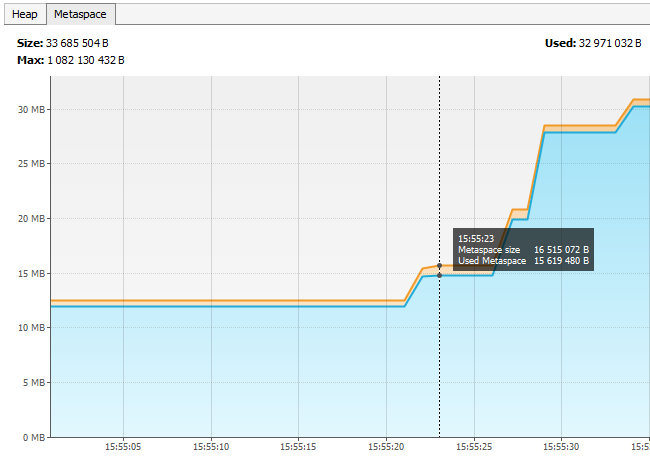
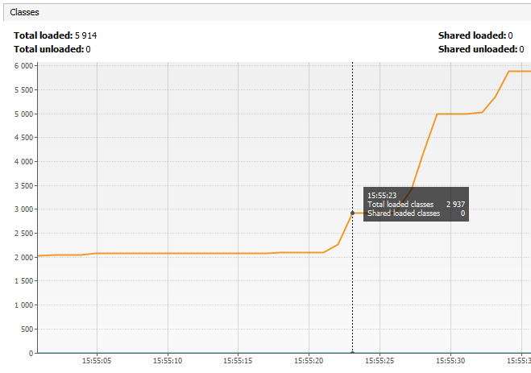
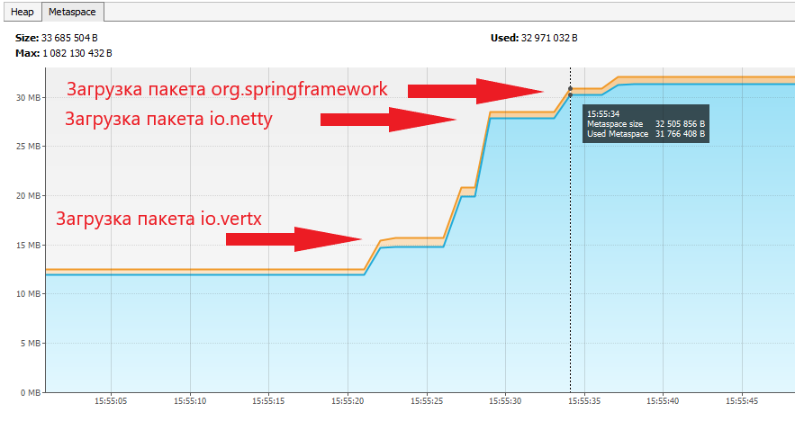
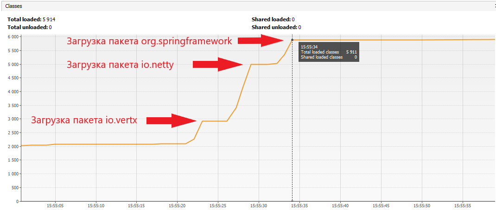
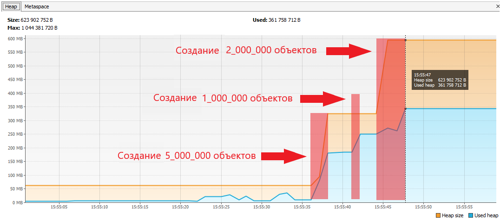
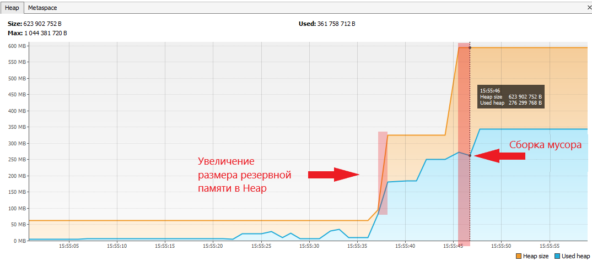

# Задача "Исследование JVM через VisualVM"

## Описание
Изучить использование памяти через VisualVM при загрузке новых классов и создании новых объектов. 
Изучить вывод консоли и код [программы](https://github.com/Arsennikum/jvm-visualvm-experience). Соотнести с графиками в разделах `Heap`, `Metaspace` и `Classes`

## Результат исследования
### Вывод консоли
```cmd
Please open 'ru.netology.JvmExperience' in VisualVm
15:55:21.777694100: loading io.vertx
15:55:22.949647900: loaded 529 classes
15:55:25.965333100: loading io.netty
15:55:28.746647600: loaded 2117 classes
15:55:31.746807900: loading org.springframework
15:55:33.778067200: loaded 869 classes
15:55:36.793789400: now see heap
15:55:36.793789400: creating 5000000 objects
15:55:38.262515300: created
15:55:41.293933300: creating 1000000 objects
15:55:41.434451700: created
15:55:44.840850700: creating 2000000 objects
15:55:47.028497: created
```

### Загрузка классов

В момент начала работы программы **ClassLoader** загружает в metaspace данные о системных классах и классе **JvmExperience** (имя, методы, поля, константы и др.).

__Загрузка пакета `io.vertx`__

* 15:55:21.777694100: loading io.vertx
* 15:55:22.949647900: loaded 529 classes

Начало загрузки классов из пакета `io.vertx`. На метриках видно начало резкого скачка занятого объема памяти в Metaspace, 
а также кол-ва загруженных классов. Загружено _**529**_ классов.




__Аналогичная загрузка пакетов `io.netty` и `org.springframework`__

* 15:55:25.965333100: loading io.netty
* 15:55:28.746647600: loaded 2117 classes
* 15:55:31.746807900: loading org.springframework
* 15:55:33.778067200: loaded 869 classes

Также загружаются другие пакеты. Загружено _**2117**_ классов пакета `io.netty` и _**869**_ классов пакета `org.springframework` .




После принудительной загрузки классов на графиках видно что дальнейших скачков увеличения размера Metaspace и количества классов нет.

### Создание объектов

* 15:55:36.793789400: creating 5000000 objects
* 15:55:38.262515300: created
* 15:55:41.293933300: creating 1000000 objects
* 15:55:41.434451700: created
* 15:55:44.840850700: creating 2000000 objects
* 15:55:47.028497: created

_15:55:36_ в момент начала генерации 5 млн. объектов на графике видно что в **Heap** происходит 
резкое увеличение используемой памяти. Аналогичное мы видим при создании 1 млн. объектов и создании 2 млн. объектов. 
Между созданиями объектов задержка в 3 с. 



На графике ниже можно увидеть что в момент когда используемая память **Heap** приближается к её размеру, то происходит 
увеличение размера **Heap**. Также можно увидеть работу **Garage collector** который очищает **Heap** от объектов которые не отмечены как **_живые_**.




